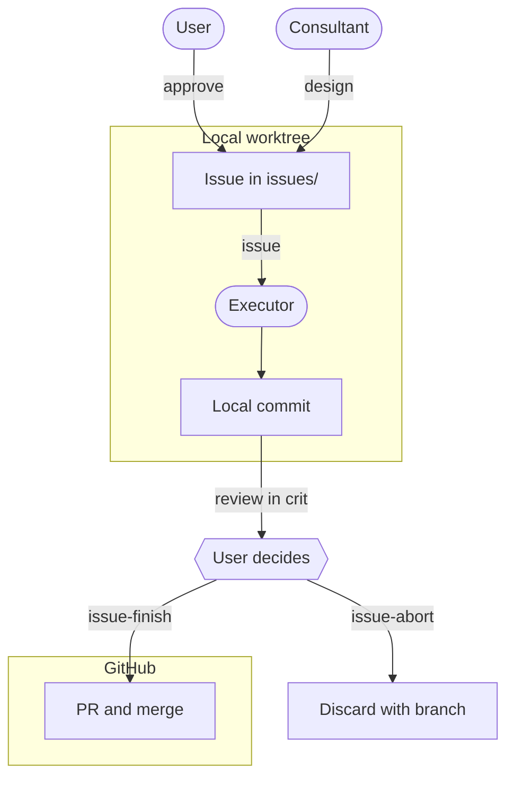

[🇯🇵 日本語](README.md) | [🇬🇧 English](README.en.md)

# AI-Agent Development Environment as Code

When developing with AI agents, the bottleneck moves from generating code to verification and conveying intent.
This repository publishes the personal development platform built on that premise, as code, together with its Nix configuration, the machinery that separates roles, and its skills. The rules to be followed are not left to documents but placed in the environment (Nix, Claude Code deny rules and hooks, skills).
The parts that carry over to team repositories are packaged separately in [sdlc-kit](https://github.com/yktsnet/sdlc-kit); this is the environment where those practices actually run.

---

## Why

Now that AI writes the code, writing is no longer where the time goes. Two things remain.

The first is **verification**: it takes time to confirm that what was written can be trusted. Agents are confidently and quietly wrong, and left alone they carry destructive operations and secret leaks straight into production. A promise that people will be careful eventually becomes an empty formality.

The second is **conveying intent**: conditions missing from a request get filled in by the agent's own inference, and it still finishes something that runs. Because it runs, the gap is easy to miss. Decisions that used to be made inside the implementer's head now have to be written down outside the code and handed over before implementation starts.

So this platform **does not assume a human who stays attentive**. Removing environment differences, blocking destructive commands, and isolating secrets are fixed in code and configuration, with a human merge as the final gate. The human decides only "what must not break" and approves it in writing; implementation and tests are left to the agents. When a promise is broken, a machine detects it and stops, so nobody has to sit and watch. The human's job moves from writing code to approving promises.

---

## Principles

The machinery is stacked in the following order.

1. **Decide the type before building**
2. **Put prohibitions in mechanisms, not requests**
3. **Place knowledge where it is read**
4. **Approve the promises first**
5. **Separate deciding from building**

The order has dependencies. Until the type is decided, what to block cannot be decided. Adding knowledge without blocks only speeds up accidents. Splitting the work before the guarantees are settled leaves the executor running without knowing what it must not break.

**The minimum is steps 1–3**, needed regardless of whether anything is published or how large the team is. Steps 4–5 are added when there is something published, or when several sessions start running in parallel.

---

## Design

### 1. Decide the Type Before Building

A new repository is classified before anything is written. [repo-standardize](.claude/skills/repo-standardize/SKILL.md) decides the repository type and its verification means, `settings.json`, and the CLAUDE.md skeleton; [repo-readme](.claude/skills/repo-readme/SKILL.md) decides the kind of README (a demonstration to show, an experiment to measure, or a tool to use); [module-dev](.claude/skills/module-dev/SKILL.md) decides the boundaries and demo approach of a module-type repository.

The type comes first so that later rules can be derived from it. Once the verification means are fixed, the contents of CI and the deny list follow; once the kind of README is fixed, the minimum set of sections follows.

### 2. Put Prohibitions in Mechanisms, Not Requests

`rebuild` commands, edits to `flake.lock`, `ssh`, and reading or writing the secrets mapping are closed off by deny rules. Deny rules only match string prefixes, so anything that has to be judged as an action, such as a path-qualified `/tmp/venv/bin/pip install` or rewriting `~/.claude` through `sed -i`, is handled by [PreToolUse hooks](.claude/hooks/).

Each hook's rejection message states both why it stopped and the correct route. A rejected agent tries something else, and what it tries comes from the message, so it takes the route written there. `static-check.sh`, which syntax-checks the single file right after each edit, follows the same idea: it takes a check that nobody would notice being skipped out of the model's discretion.

### 3. Place Knowledge Where It Is Read

Rules are placed according to when they are read. Rules that apply every time go in CLAUDE.md, procedures and criteria whose trigger can be stated as "when doing X" go in skills, and anything that must not be crossed goes in deny rules and hooks. If "which file to give the AI, and when" stays as someone's tacit knowledge, the AI cannot reproduce the operation on its own. So procedures become skills, each declaring its trigger in its description. The workflows covered in the following sections (`new-issue`, `guarantee-audit`, and others) are committed in this same form. The placement criteria live in [skill-dev](.claude/skills/skill-dev/SKILL.md).

Skills split into those that carry **judgment**, whose answer changes per repository, and those that carry **routine**, which can be applied mechanically once decided. How to write a README, how to cut a module, and whether to draw a diagram are the former; scaffolding, CI, the guarantee ledger, and the Issue format are the latter. When many repositories run in parallel, the cost paid on judgment governs throughput. Whatever can be turned into routine is moved there, leaving human time only where judgment is needed.

As rules accumulate, they start to contradict each other. CLAUDE.md, skills, and persistent memory are all "rules written by people and read by AI," with no way to detect their own contradictions. [consolidate-rules](.claude/skills/consolidate-rules/SKILL.md) periodically audits only what changed since the last inventory point (a one-line anchor in `.claude/RULES.md`), and when the model generation changes it also checks for model-specific rules that have gone stale. Persistent memory has no index; it lives directly under `~/memory/`, one fact per file (kept at a granularity where `ls` is the index).

### 4. Approve the Promises First

Tests are the device by which the executor notices on its own that it broke something. What must not break (the guarantees) is approved by a human in the Issue's guarantee section, and the tests that turn it into something executable are written by the executor. This division of labor is called **Guarantee-Driven Development (GDD)**. If TDD is the discipline of writing tests first, GDD is the discipline of approving the promises first.

Approved guarantees accumulate in each repository's guarantee ledger, `docs/guarantees.md`. The ledger lists only contract-surface guarantees (public API, CLI, externally observable behavior) that tests back up. Behavior not in the ledger is not a promise and may change without notice. The ledger is maintained as follows.

- **Laying it down**: [guarantee-audit](.claude/skills/guarantee-audit/SKILL.md) extracts guarantees from existing tests and lays down the ledger after the user approves it. Guarantees that should exist but have no test are recorded separately in a Gaps section
- **Keeping up**: from then on, tests and ledger are updated in the same PR as the Issue's guarantee section. The executor's procedure ([pr-workflow](.claude/skills/pr-workflow/SKILL.md)) treats a missing ledger update as unfinished work
- **Matching the scope**: before committing, the executor confirms that the list of staged files exactly matches the Issue's `対象` (targets) field. A change that strays outside the declared scope never reaches a commit
- **Seeing it all**: the ledger stays in each repository as the source of truth, while a scheduled job gathers links to every repository that has one into a single index, so whoever approves can see what is being promised across the board

Development runs in two phases, handing over the driving documents. In the launch phase, before the direction is settled, work is implemented directly while PLAN.md (remaining work) and JUDGE.md (design decisions) grow alongside it ([mvp-docs](.claude/skills/mvp-docs/SKILL.md)). Once the guarantee ledger goes into formal use, the repository moves to the Issue-driven phase and is run on the ledger and tests from then on. Each repository declares its phase in its CLAUDE.md. The full idea is in sdlc-kit's [docs/lifecycle.md](https://github.com/yktsnet/sdlc-kit/blob/main/docs/lifecycle.md).

### 5. Separate Deciding from Building

When the same model both decides and builds, it cannot notice on its own that it has gone off course. The work is split into three roles.

- **Consultant**: investigates and designs the Issue in dialogue with the user. Does not implement ([new-issue](.claude/skills/new-issue/SKILL.md))
- **Executor**: takes an Issue and carries it through implementation, tests, static checks, and a local commit. Never touches the remote ([pr-workflow](.claude/skills/pr-workflow/SKILL.md))
- **User**: approves the Issue's guarantee section, reviews the commits, and publishes them

Role boundaries are handed over through zsh functions.

- **`issue-open`**: moves an Issue whose guarantee section has been approved from `draft` to `open`
- **`issue`**: picks an `open` Issue, creates a worktree, and launches the executor, leaving the main checkout untouched
- **`issue-abort`**: discards an in-progress worktree together with its branch
- **`issue-finish`**: pushes the reviewed branch, opens the PR, merges it, and cleans up in one go

The only way out to the remote is the user's `issue-finish`. The executor's changes are reviewed line by line by opening [crit](https://github.com/tomasz-tomczyk/crit) inside the executor's own session, and review comments go back to that session to be fixed. Worktrees are isolated, so the machinery could run Issues in parallel, but they are implemented one at a time: working in series is what makes the user's review and approval hold.

Three exceptions keep the separation from becoming rigid: incident response that cannot be designed as an Issue in advance, one-off exceptions the user explicitly declares, and a lightweight path that lets small changes touching neither logic nor the guarantee ledger through without an Issue.

In practice, several consultant sessions and worktrees run at once, and none of them can notice its own drift, for the same reason. The reader standing outside them is [session-nudge](.claude/skills/session-nudge/SKILL.md), launched with `M-m`. It reads another session's exchange and drafts advice, which is sent only after the user approves the draft. It never intervenes in another session automatically.

---

## Foundation

### One Toolchain on Every Machine

One flake manages the macOS and Linux development machines. When tools or versions differ between machines, agents stall on commands that are not found or fail at runtime.

| Configuration | OS | Role |
|---|---|---|
| `linux-desktop` | NixOS (disko / SSD) | Primary dev machine. Where consultant chat and `issue` are launched |
| `macbook` | macOS (nix-darwin) | Shares the home-manager layer with the Linux machine |

OS differences are confined to `pkgs.stdenv.isDarwin` on the Nix side and to the shims in `os.sh` (`_is_darwin`, `_sed_i`, `_open`, `_linux_only`) on the shell side; everything else is the same file on both. When an agent reaches for `brew` or `npm -g`, `block-non-nix-install.sh` stops it and points to the Nix procedure ([nix-tool-install](.claude/skills/nix-tool-install/SKILL.md)).

### One Source for Every Session

The settings, hooks, and skills in `.claude/`, together with `home-manager/config/claude/common.md`, are the source of truth. `home-manager/modules/claude.nix` copies them into `~/.claude` on every rebuild, so the same rules apply whichever repository or machine Claude Code is opened on. Since `~/.claude` is a generated artifact, `block-live-claude-config-edit.sh` rejects direct edits there and returns the source path instead. Persistent memory is put on the git path by `memory.nix` so every machine sees the same set.

### Secrets Stay Out of the Prose

Issues, PRs, and commit messages use `<PLACEHOLDER>` instead of IPs, ports, and real hostnames. The mapping between real values and placeholders lives in `secrets-agents/`, which agents are not allowed to read or write.

If the mapping existed on only one machine, writing on any other machine would mean not knowing what to mask. The mapping is encrypted with sops (age) and distributed through git, and each machine decrypts it with its own key ([sops-secrets](.claude/skills/sops-secrets/SKILL.md)).

---

## Skills

Criteria and procedures are owned by the skill that uses them. The criteria for what gets published are in [.claude/skills/README.md](.claude/skills/README.md).

| Step | Skill | Owns |
|---|---|---|
| 1. Type | [repo-standardize](.claude/skills/repo-standardize/SKILL.md) | Repository type and verification means, settings.json, CLAUDE.md and context/, file hygiene. CI/CD in [reference/cicd.md](.claude/skills/repo-standardize/reference/cicd.md) |
| | [repo-readme](.claude/skills/repo-readme/SKILL.md) | README kind, minimum sections, core message, outline |
| | [module-dev](.claude/skills/module-dev/SKILL.md) | Module-type repository shape, boundaries, demos |
| | [mermaid-diagram](.claude/skills/mermaid-diagram/SKILL.md) | Whether to draw, width limits, shapes and line styles |
| 3. Knowledge | [skill-dev](.claude/skills/skill-dev/SKILL.md) | Placement criteria, narrowing auto-invocation, splitting exploration |
| | [consolidate-rules](.claude/skills/consolidate-rules/SKILL.md) | Inventory of contradictory or stale rules |
| 4. Promises | [guarantee-audit](.claude/skills/guarantee-audit/SKILL.md) | Test policy (GDD), laying down and auditing the guarantee ledger |
| | [mvp-docs](.claude/skills/mvp-docs/SKILL.md) | PLAN.md / JUDGE.md for the launch phase |
| 5. Roles | [new-issue](.claude/skills/new-issue/SKILL.md) | Phases, role separation, the three exceptions, Issue design |
| | [pr-workflow](.claude/skills/pr-workflow/SKILL.md) | The executor's work from implementation to local commit |
| | [session-nudge](.claude/skills/session-nudge/SKILL.md) | Consulting on another session from the outside |
| Publishing | [readme-i18n](.claude/skills/readme-i18n/SKILL.md), [repo-publish](.claude/skills/repo-publish/SKILL.md), [repo-about](.claude/skills/repo-about/SKILL.md) | English README, publishing, About and topics |
| Foundation | [nix-tool-install](.claude/skills/nix-tool-install/SKILL.md), [sops-secrets](.claude/skills/sops-secrets/SKILL.md), [jp-writing](.claude/skills/jp-writing/SKILL.md) | Installing through Nix, encrypting secrets, Japanese writing rules |

Step 2 (putting prohibitions in mechanisms) is owned not by a skill but by `.claude/settings.json` and [`.claude/hooks/`](.claude/hooks/). How to write hooks is in [.claude/hooks/README.md](.claude/hooks/README.md).

---

## Tech Stack

| Layer | Technology | Reason |
|---|---|---|
| Configuration | Nix Flakes, home-manager | Builds every machine's tools and settings from one declaration, so agents do not stall on machine differences |
| macOS | nix-darwin | Lets macOS share the home-manager layer with the Linux machine |
| Disk | disko | Brings even the partition layout into the Nix declaration |
| Secrets | sops-nix, age | Ships ciphertext through git and lets each machine decrypt with its own key; plaintext never travels between machines |
| Agent | Claude Code | Its `settings.json` deny rules and PreToolUse hooks let prohibitions live as mechanisms rather than documents |
| Review | crit | Gives the user and the agent one shared entry point for reviewing the executor's diff and local pages |
| Hand-off | zsh | Turns each role boundary, from creating a worktree to publishing, into one command |
| Sessions | tmux, tmux-claude-session-manager | Moves between parallel Claude Code sessions |

---

## Scope

Only the layers involved in developing with agents (Claude Code, memory, secrets, review, and tmux session management) are extracted from the working dotfiles. Besides the two machines shown here, the working flake also covers headless servers and WSL, and holds editor and desktop settings and fleet status checks; none of those are included. Unifying tools through Nix, distributing `~/.claude`, decrypting the mapping, and persistent memory are tied to the machine and cannot be enforced from a team repository, so they are kept here rather than in sdlc-kit.

The repository is not meant to be cloned and applied to your own machines, so no setup steps are given. The device configurations assume the actual hardware and keys, and the encrypted contents of `secrets/` are not included. CI's `nix flake check` confirms that the published configuration still evaluates.

---

## Repository Map

| Path | Contents | Section |
|---|---|---|
| `.claude/skills/` | Procedures and criteria. Index in [Skills](#skills) | All of Design |
| `.claude/settings.json`, `.claude/hooks/` | Deny rules and hooks | 2. Prohibitions in Mechanisms |
| `home-manager/modules/` | Claude Code distribution, memory, secrets, tmux, crit. Issue-driven functions in `zsh/` | 5. Separate Deciding from Building, One Source |
| `issues/` | This repository's own Issues and PR records | 5. Separate Deciding from Building |
| `flake.nix`, `devices/` | NixOS / nix-darwin configurations for the dev machines. Shared parts in `devices/common/` | One Toolchain |
| `secrets-agents/` | Where the mapping is decrypted (`example.md` is a sample) | Secrets |
