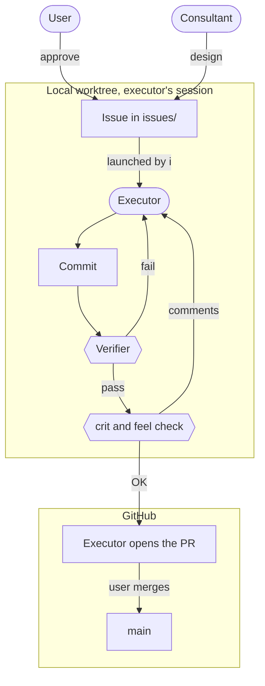

[🇯🇵 日本語](README.md) | [🇬🇧 English](README.en.md)

# AI-Agent Development Environment as Code

When developing with AI agents, the bottleneck moves from generating code to verification and conveying intent.
This repository publishes the personal development platform built on that premise, as code, together with its Nix configuration, the machinery that separates roles, and its skills. The rules to be followed are not left to documents but placed in the environment (Nix, Claude Code deny rules and hooks, skills).
The parts that carry over to team repositories are packaged separately in [sdlc-kit](https://github.com/yktsnet/sdlc-kit); this is the environment where those practices actually run.

---

## Why

Now that AI writes the code, writing is no longer where the time goes. Two things remain.

The first is **verification**: it takes time to confirm that what was written can be trusted. Agents are confidently and quietly wrong, and left alone they carry destructive operations and secret leaks straight into production. A promise that people will be careful eventually becomes an empty formality.

The second is **conveying intent**: conditions missing from a request get filled in by the agent's own inference, and it still finishes something that runs. Because it runs, the gap is easy to miss. Decisions that used to be made inside the implementer's head now have to be written down outside the code and handed over before implementation starts.

So this platform **does not assume a human who stays attentive**. Removing environment differences, blocking destructive commands, and isolating secrets are fixed in code and configuration, with a human merge as the final gate. The human decides "what must not break" and approves it in writing; implementation and tests are left to the agents. When a promise is broken, a machine detects it and stops, so nobody has to sit and watch.

The dividing line is **whether it can be written down and handed over**. Behavior can be, so the agent runs the checks written in the Issue and confirms it itself. Feel, how it is to use, cannot: the agent has little sense of intent or feeling, and even in words a person cannot hand it over completely. So a person touches it and decides. The human's job moves from writing code and matching behavior by hand to approving promises and judging what cannot be written down.

---

## Principles

The machinery rests on three principles.

1. **Write the promises down first**
2. **Let mechanisms and separate contexts do the checking**
3. **Leave humans only the judgments that cannot be written down**

Principles 1 and 2 answer the two bottlenecks in Why (conveying intent and verification); principle 3 answers the dividing line between them (whether something can be written down and handed over). The order has dependencies. Without written promises, the mechanisms do not know what to enforce, and a separate context does not know what to check against. Without mechanisms that check, matching and watching creep back into the judgments meant to be left to humans.

Deciding the repository type, placing the rules, and deny rules with hooks are needed from the start, whatever the scale. The guarantee ledger and role separation are added when there is something published, or when several sessions start running in parallel.

---

## Design

### 1. Write the Promises Down First

Agents fill in unwritten conditions by inference. So whatever a human decides is written down and handed over before anything is built.

At the center is **Guarantee-Driven Development (GDD)**. A human approves what must not break (the guarantees) in the Issue's guarantee section, and the agent writes the tests that pin it down along with the implementation. If TDD is the discipline of writing tests first, GDD is the discipline of approving the promises first. Approved guarantees accumulate, together with the tests behind them, in each repository's guarantee ledger, `docs/guarantees.md`. Behavior not in the ledger is not a promise ([guarantee-audit](.claude/skills/guarantee-audit/SKILL.md), [Zenn: Guarantee-Driven Development](https://zenn.dev/yktsnet/articles/202608-guarantee-driven-development)).

Development runs in two phases, **handing over the driving documents**. In the launch phase, before the direction is settled, PLAN.md (remaining work) and JUDGE.md (design decisions) drive the work ([mvp-docs](.claude/skills/mvp-docs/SKILL.md)). Once the guarantee ledger goes into formal use, it takes over and the repository moves to the Issue-driven phase. The full idea is in sdlc-kit's [docs/lifecycle.md](https://github.com/yktsnet/sdlc-kit/blob/main/docs/lifecycle.md).

Promises are not the only thing written down before building. The repository type (its kind and verification means, the kind of README) is decided before anything is written ([repo-standardize](.claude/skills/repo-standardize/SKILL.md), [repo-readme](.claude/skills/repo-readme/SKILL.md), [module-dev](.claude/skills/module-dev/SKILL.md)). Rules are placed according to when they are read: what applies every time goes in CLAUDE.md, and procedures whose trigger can be stated as "when doing X" go in skills ([skill-dev](.claude/skills/skill-dev/SKILL.md)).

### 2. Let Mechanisms and Separate Contexts Do the Checking

Agents are confidently and quietly wrong. A promise that people will be careful decays into a formality, so checking is not left to human attention.

**Mechanisms**: what must not be crossed (`rebuild` commands, edits to `flake.lock`, `ssh`, the secrets mapping) is stopped by deny rules and [hooks](.claude/hooks/). Each hook's rejection message states why it stopped and the correct route, because a rejected agent tries something else and what it tries comes from the message. Hooks also stop branch switching in the main checkout and put an approval in front of writes to persistent memory. Values that can be derived from elsewhere, such as counts, lists, and indexes, are not written by hand; scripts and CI write them out and fail on drift. Calling a subagent is put in a mechanism too, not requested: after Japanese documents are edited, a Stop hook hands them to the proofreader ([jp-proofreader](.claude/agents/jp-proofreader.md)) outside the conversation, and the result arrives on the next turn.

**Separate contexts**: when the same model builds and checks, it cannot notice on its own that it has gone off course. The consultant designs the Issue ([local-issue](.claude/skills/local-issue/SKILL.md)), the executor implements it ([pr-workflow](.claude/skills/pr-workflow/SKILL.md)), and the verifier ([issue-verifier](.claude/agents/issue-verifier.md)) checks the work against the Issue alone. The verifier is never given the executor's explanation, because it would then read the work through the executor's intent and lose sight of where it drifts from the promise. For changes that show up on a screen, [screen-operator](.claude/agents/screen-operator.md) operates the screen and returns what it saw. A subagent is not added at a step that another context already checks, and is added for one of three reasons only: objectivity, speed, or automation (skill-dev, section 6). Contradictions between rules are also hard for their authors to see, so [consolidate-rules](.claude/skills/consolidate-rules/SKILL.md) audits them separately.

Role boundaries are handed over through a single zsh function, `i`. It launches an executor per worktree and takes care of merging and cleanup ([docs/issue-workflow.md](docs/issue-workflow.md), [Zenn: Issue-Driven Workflow](https://zenn.dev/yktsnet/articles/202604-issue-driven-workflow)). From outside the parallel sessions, [session-nudge](.claude/skills/session-nudge/SKILL.md) acts as a reader and drafts advice.

### 3. Leave Humans Only the Judgments That Cannot Be Written Down

The dividing line is whether something can be written down and handed over. Behavior can, so it is promised under principle 1 and checked under principle 2. How it feels to use, and whether it matches the intent, cannot: the agent has little sense of intent or feeling, and even in words a person cannot hand it over completely. Only this is left to humans.

The user holds four things: approving the guarantee section, checking feel and real-machine behavior in the executor's session, deciding whether to accept anything that strays from the promise, and merging. The gates to the remote are the OK in the executor's session and the merge. The user is never asked to match behavior, and nothing is shown at two steps.

Narrowing this down also keeps human judgment from thinning out. As speed goes up, people grasp less and approvals drift into formality. Having handed off behavior matching, people no longer trace behavior themselves; in exchange, what they look at is narrowed to what only they can judge. Running at most three Issues in parallel, only ones that do not depend on each other, with checks and fixes closed within each executor's session, serves the same end: every approval still holds as the count grows.

---

## Foundation

### One Toolchain on Every Machine

One flake manages the macOS and Linux development machines. When tools or versions differ between machines, agents stall on commands that are not found or fail at runtime.

| Configuration | OS | Role |
|---|---|---|
| `linux-desktop` | NixOS (disko / SSD) | Primary dev machine. Where consultant chat and `i` are launched |
| `macbook` | macOS (nix-darwin) | Shares the home-manager layer with the Linux machine |

OS differences are confined to `pkgs.stdenv.isDarwin` on the Nix side and to the shims in `os.sh` (`_is_darwin`, `_sed_i`, `_open`, `_linux_only`) on the shell side; everything else is the same file on both. When an agent reaches for `brew` or `npm -g`, `block-non-nix-install.sh` stops it and points to the Nix procedure ([nix-tool-install](.claude/skills/nix-tool-install/SKILL.md)).

### One Source for Every Session

The settings, hooks, and skills in `.claude/`, together with `home-manager/config/claude/common.md`, are the source of truth. `home-manager/modules/claude.nix` copies them into `~/.claude` on every rebuild, so the same rules apply whichever repository or machine Claude Code is opened on. Since `~/.claude` is a generated artifact, `block-live-claude-config-edit.sh` rejects direct edits there and returns the source path instead. Persistent memory is put on the git path by `memory.nix` so every machine sees the same set.

### Secrets Stay Out of the Prose

Issues, PRs, and commit messages use `<PLACEHOLDER>` instead of IPs, ports, and real hostnames. The mapping between real values and placeholders lives in `secrets-agents/`, which agents are not allowed to read or write.

If the mapping existed on only one machine, writing on any other machine would mean not knowing what to mask. The mapping is encrypted with sops (age) and distributed through git, and each machine decrypts it with its own key ([sops-secrets](.claude/skills/sops-secrets/SKILL.md)).

---

## Skills

Procedures and criteria are owned by the skill that uses them, and each Design section links to them. The full index and the criteria for what gets published are in [.claude/skills/README.md](.claude/skills/README.md). Subagent definitions live in [.claude/agents/](.claude/agents/), and hooks in [.claude/hooks/](.claude/hooks/).

---

## Tech Stack

| Layer | Technology | Reason |
|---|---|---|
| Configuration | Nix Flakes, home-manager | Builds every machine's tools and settings from one declaration, so agents do not stall on machine differences |
| macOS | nix-darwin | Lets macOS share the home-manager layer with the Linux machine |
| Disk | disko | Brings even the partition layout into the Nix declaration |
| Secrets | sops-nix, age | Ships ciphertext through git and lets each machine decrypt with its own key; plaintext never travels between machines |
| Agent | Claude Code | Its `settings.json` deny rules and PreToolUse hooks let prohibitions live as mechanisms rather than documents |
| Review | crit | Gives the user and the agent one shared entry point for reviewing the executor's diff and local pages |
| Hand-off | zsh | Turns each role boundary, from creating a worktree to publishing, into one command |
| Sessions | tmux, tmux-claude-session-manager | Moves between parallel Claude Code sessions |

---

## Scope

Only the layers involved in developing with agents (Claude Code, memory, secrets, review, and tmux session management) are extracted from the working dotfiles. Besides the two machines shown here, the working flake also covers headless servers and WSL, and holds editor and desktop settings and fleet status checks; none of those are included. Unifying tools through Nix, distributing `~/.claude`, decrypting the mapping, and persistent memory are tied to the machine and cannot be enforced from a team repository, so they are kept here rather than in sdlc-kit.

The repository is not meant to be cloned and applied to your own machines, so no setup steps are given. The device configurations assume the actual hardware and keys, and the encrypted contents of `secrets/` are not included. CI's `nix flake check` confirms that the published configuration still evaluates.
