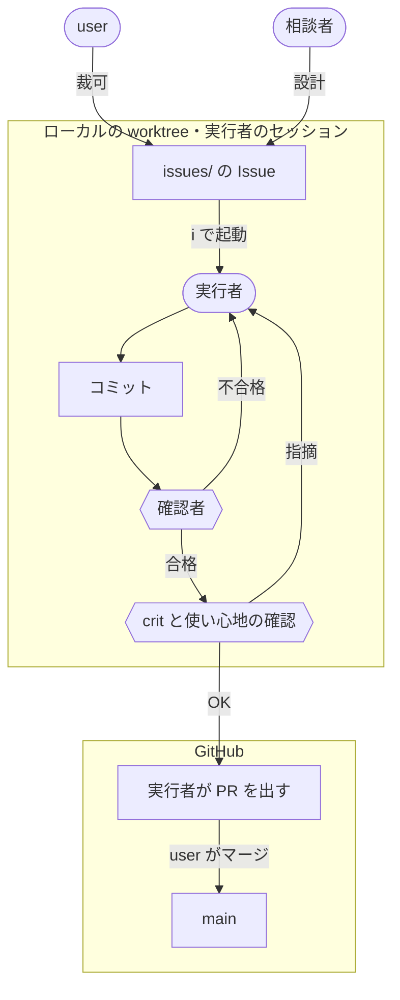

[🇯🇵 日本語](README.md) | [🇬🇧 English](README.en.md)

# AI-Agent Development Environment as Code

AI エージェントとの開発では、ボトルネックはコードの生成から、検証と意図伝達へ移る。
本リポジトリは、その前提で組んだ個人の開発基盤を、Nix 構成・役割分離の実行機構・skill 群ごとコードとして公開する実例である。守らせたい規則は文書に頼まず、環境（Nix・Claude Code の deny とフック・skill）に置いている。
チームのリポジトリへ持ち込める分は [sdlc-kit](https://github.com/yktsnet/sdlc-kit) に切り出しており、ここはその型を実際に回している環境にあたる。

---

## Why

AI がコードを書くようになって、時間がかかるのは書くことではなくなった。残ったのは2つである。

1つは**検証**である。書かれたものを信じてよいか確かめることに時間がかかる。エージェントは自信を持ったまま静かに間違え、放っておけば破壊的な操作や機密の漏洩をそのまま本番へ通す。人が気をつけるという約束は、いずれ形骸化する。

もう1つは**意図伝達**である。依頼に書かれていない条件は、エージェントが推論で埋めて、動くものを仕上げてしまう。動くので、空白があったことに気づきにくい。これまで実装者の頭の中で下されていた判断を、実装の前にコードの外へ書き出して渡す必要がある。

そのため、この基盤は**注意し続ける人間を前提にしない**。環境差の排除・破壊的なコマンドの遮断・機密の隔離はコードと設定で固定し、人間のマージを最後の関門に置く。人間は「何が壊れてはいけないか」を決めて文書で裁可し、実装とテストはエージェントに任せる。約束が破られれば機械が検知して止まるので、張り付いて見張らずに済む。

分かれ目は、**書いて渡せるか**である。挙動は書いて渡せるので、Issue に書いた確認をエージェントが自分で動かして確かめる。使い心地は、エージェントが意図や感覚を持ちにくく、人が言葉にしても渡しきれない。だから人が触って判断する。人間の仕事は、コードを書くことと動作を照合することから、約束を裁可することと、書いて渡せない感覚を判断することへ移る。

---

## Principles

仕組みは3つの原則で組んでいる。

1. **守る約束を先に書く**
2. **確かめるのは仕組みと別の文脈**
3. **人には書けない判断だけを残す**

1 と 2 が Why の2つのボトルネック（意図伝達と検証）に、3 がその分かれ目（書いて渡せるか）に答える。順序には依存がある。約束が書かれていないと、仕組みは何を守らせるかが、別の文脈は何を基準に確かめるかが決まらない。確かめる仕組みが無いと、人に残したはずの判断に照合と見張りが混ざる。

型の判定と規則の置き場、deny とフックは、規模によらず最初から要る。保証台帳と役割の分離は、公開物を持つとき、または複数のセッションを並行して回し始めたときに足す。

---

## Design

### 1. 守る約束を先に書く

エージェントは、書かれていない条件を推論で埋める。だから人が決めることは、作る前に書いて渡す。

中心は**保証駆動開発**（Guarantee-Driven Development, GDD）である。何が壊れてはいけないか（保証）を人が Issue の保証節で裁可し、それを固定するテストと実装はエージェントが書く。TDD がテストを先に書く規律なら、GDD は約束の裁可を先に行う規律である。裁可した保証は各リポの保証台帳 `docs/guarantees.md` に、裏付けるテストと一緒に積み上がる。台帳に載っていない振る舞いは約束ではない（[guarantee-audit](.claude/skills/guarantee-audit/SKILL.md)、[Zenn: 保証駆動開発](https://zenn.dev/yktsnet/articles/202608-guarantee-driven-development)）。

開発は2つのフェーズで**駆動文書を交代させる**。方向が固まらない立ち上げ期は PLAN.md（残作業）と JUDGE.md（設計判断）が開発を駆動し（[mvp-docs](.claude/skills/mvp-docs/SKILL.md)）、保証台帳が正式運用に上がった時点で台帳へ交代して Issue 駆動期に入る。考え方の全体は sdlc-kit の [docs/lifecycle.md](https://github.com/yktsnet/sdlc-kit/blob/main/docs/lifecycle.md) にある。

約束のほかにも、作る前に書いて渡すものがある。リポの型（類型と検証手段、README の種別）は書き始める前に決める（[repo-standardize](.claude/skills/repo-standardize/SKILL.md)・[repo-readme](.claude/skills/repo-readme/SKILL.md)・[module-dev](.claude/skills/module-dev/SKILL.md)）。規則は読まれる場面で置き場を分け、毎回守らせるものは CLAUDE.md に、「〜するとき」と条件を言える手順は skill に置く（[skill-dev](.claude/skills/skill-dev/SKILL.md)）。

### 2. 確かめるのは仕組みと別の文脈

エージェントは自信を持ったまま静かに間違える。人が気をつけるという約束は形骸化するので、確かめることを人の注意に預けない。

**仕組み**：外れてはいけないもの（`rebuild` 系、`flake.lock` の編集、`ssh`、機密の対応表）は deny と[フック](.claude/hooks/)で止める。フックの拒否文には、止めた理由と正しい経路を書く。エージェントは拒否されると別の手を試し、何を試すかは拒否文で決まるからである。元のチェックアウトでのブランチの切り替えはフックが止め、永続メモリへの書き込みには承認を挟む。件数・一覧・索引のように他から導ける値は手で書かず、スクリプトと CI が書き出してずれを落とす。subagent を呼ぶことも、頼まずに仕組みに置く。書き換えた日本語の文書は、Stop フックが会話の外で校正役（[jp-proofreader](.claude/agents/jp-proofreader.md)）に回し、結果は次のターンで渡す。

**別の文脈**：同じモデルが作って確かめると、外したことに自分では気づけない。相談者が Issue を設計し（[local-issue](.claude/skills/local-issue/SKILL.md)）、実行者が実装し（[pr-workflow](.claude/skills/pr-workflow/SKILL.md)）、確認者（[issue-verifier](.claude/agents/issue-verifier.md)）が Issue だけを基準に確かめる。確認者に実行者の説明を渡さないのは、渡すと実行者の意図を前提に読み、約束から外れたところが見えなくなるからである。画面に出る変更は [screen-operator](.claude/agents/screen-operator.md) が操作して、見えたものを返す。subagent は、すでに別の文脈が確かめている段には足さない。足す理由は客観性・速さ・自動化に限る（skill-dev の 6）。規則同士の食い違いも書いた本人には見つけにくいので、[consolidate-rules](.claude/skills/consolidate-rules/SKILL.md) が別に棚卸しする。

役割の境目は、zsh の関数 `i` 1つで渡す。worktree ごとに実行者を起動し、マージと後片付けまでを受け持つ（[docs/issue-workflow.md](docs/issue-workflow.md)、[Zenn: Issue 駆動ワークフロー](https://zenn.dev/yktsnet/articles/202604-issue-driven-workflow)）。並行するセッションの外からは、[session-nudge](.claude/skills/session-nudge/SKILL.md) が読み手として助言を起こす。

### 3. 人には書けない判断だけを残す

分かれ目は、書いて渡せるかである。挙動は書いて渡せるので、1 で約束し、2 で確かめる。使い心地や意図に合っているかは、エージェントが意図や感覚を持ちにくく、人が言葉にしても渡しきれない。人に残すのはこれだけにする。

user が持つのは4つである。保証節の裁可、実行者のセッションでの使い心地と実機の確認、約束から外れたことを採るかの判断、マージ。リモートへ出る関門は、実行者のセッションでの OK とマージの2か所になる。挙動の照合は頼まず、同じものを2つの段で見せない。

絞るのは、人の判断を薄めないためでもある。速度が上がるほど人の把握は減り、裁可は形だけになりやすい。挙動の照合を手放した分、人は挙動を自分で辿らなくなる。その代わりに、人が見るものを本人にしか判断できないものへ絞る。並行を依存し合わない Issue の3本までにして、確認と直しを実行者のセッションごとに閉じているのも、本数が増えても一つ一つの裁可が成り立つようにするためである。

---

## Foundation

### 全端末で道具を揃える

macOS と Linux の開発機を1つの Flake で管理する。端末ごとに道具の有無や版が違うと、エージェントはコマンドが見つからない、実行時に失敗する、といった形で止まる。

| 構成 | OS | 役割 |
|---|---|---|
| `linux-desktop` | NixOS（disko / SSD） | 主開発機。相談者チャットと `i` の起動元 |
| `macbook` | macOS（nix-darwin） | home-manager 層を Linux 機と共有する |

OS の差は、Nix 側では `pkgs.stdenv.isDarwin`、シェル側では `os.sh` のシム（`_is_darwin` / `_sed_i` / `_open` / `_linux_only`）に閉じ込め、それ以外は両 OS が同じファイルを読む。エージェントが `brew` や `npm -g` に手を伸ばすと `block-non-nix-install.sh` が止め、Nix で入れる手順（[nix-tool-install](.claude/skills/nix-tool-install/SKILL.md)）へ案内する。

### 規則を1か所から全セッションへ配る

`.claude/` の settings・hooks・skills と `home-manager/config/claude/common.md` が正本で、`home-manager/modules/claude.nix` が rebuild のたびに `~/.claude` へ実体コピーする。どのリポジトリ、どの端末で Claude Code を開いても、同じ規則が効く。`~/.claude` 側は生成物になるので、そこを直接編集しようとすると `block-live-claude-config-edit.sh` が止め、正本のパスを返す。永続メモリは `memory.nix` で git の経路に乗せ、端末間で揃える。

### 機密を地の文に出さない

Issue・PR・コミットの地の文には、IP・ポート・実ホスト名を書かずに `<PLACEHOLDER>` を使う。実値とプレースホルダの対応表は `secrets-agents/` に置き、エージェントからは読み書きさせない。

対応表が1台にしか無いと、別の端末では何を伏せるべきか分からないまま書くことになる。対応表は sops（age）で暗号化して git で配り、各端末が自分の鍵で復号する（[sops-secrets](.claude/skills/sops-secrets/SKILL.md)）。

---

## Skills

基準と手順は、それを使う skill が持つ。何を公開するかの基準は [.claude/skills/README.md](.claude/skills/README.md) にある。

| 原則 | skill・agent・フック | 持つもの |
|---|---|---|
| 1. 約束を書く | [guarantee-audit](.claude/skills/guarantee-audit/SKILL.md) | テスト方針（GDD）・保証台帳の敷設と棚卸し |
| | [mvp-docs](.claude/skills/mvp-docs/SKILL.md) | 立ち上げ期の PLAN.md / JUDGE.md |
| | [local-issue](.claude/skills/local-issue/SKILL.md) | フェーズ・担当分離・例外の3経路・Issue と保証節の設計 |
| | [repo-standardize](.claude/skills/repo-standardize/SKILL.md) | リポ類型と検証手段・settings.json・CLAUDE.md と context/・ファイル衛生。CI/CD は [reference/cicd.md](.claude/skills/repo-standardize/reference/cicd.md) |
| | [repo-readme](.claude/skills/repo-readme/SKILL.md)・[module-dev](.claude/skills/module-dev/SKILL.md)・[mermaid-diagram](.claude/skills/mermaid-diagram/SKILL.md) | README の種別と下限・モジュール型リポの境界とデモ・図を描くかと描き方 |
| | [skill-dev](.claude/skills/skill-dev/SKILL.md) | 置き場の基準・自動発火の絞り方・探索の分け方・subagent を足す段 |
| 2. 確かめる | [`.claude/hooks/`](.claude/hooks/)・`.claude/settings.json` | deny とフック。書き方は [.claude/hooks/README.md](.claude/hooks/README.md) |
| | [pr-workflow](.claude/skills/pr-workflow/SKILL.md) | 実行者の実装・確認者の判定・user への受け渡し・PR |
| | [issue-verifier](.claude/agents/issue-verifier.md) | 実行者のブランチを Issue だけで確かめる subagent |
| | [screen-operator](.claude/agents/screen-operator.md) | 画面を操作して見えたものを返す subagent |
| | [jp-proofreader](.claude/agents/jp-proofreader.md) | Stop フックが会話の外で回す、日本語の文書の校正役 |
| | [consolidate-rules](.claude/skills/consolidate-rules/SKILL.md) | 規則同士の矛盾・陳腐化の棚卸し |
| | [session-nudge](.claude/skills/session-nudge/SKILL.md) | 別セッションを外から客観視する相談 |
| 公開 | [readme-i18n](.claude/skills/readme-i18n/SKILL.md)・[repo-publish](.claude/skills/repo-publish/SKILL.md)・[repo-about](.claude/skills/repo-about/SKILL.md) | 英語版 README・公開手続き・About と topics |
| Foundation | [nix-tool-install](.claude/skills/nix-tool-install/SKILL.md)・[sops-secrets](.claude/skills/sops-secrets/SKILL.md)・[jp-writing](.claude/skills/jp-writing/SKILL.md) | Nix 経由の導入・機密の暗号化・日本語の文章規範 |

原則 3（人には書けない判断だけを残す）は skill ではなく、`local-issue` と `pr-workflow` が user に返す止まる点が持つ。

---

## Tech Stack

| Layer | Technology | Reason |
|---|---|---|
| 構成管理 | Nix Flakes・home-manager | 全端末の道具と設定を1つの宣言から作れる。エージェントが端末差で止まらない |
| macOS | nix-darwin | macOS でも home-manager 層を Linux 機と共有できる |
| ディスク | disko | パーティション構成まで Nix の宣言に含められる |
| 機密 | sops-nix・age | 暗号文のまま git で配り、各端末が自分の鍵で復号できる。平文を端末間で運ばない |
| エージェント | Claude Code | `settings.json` の deny と PreToolUse フックで、禁止を文書ではなく機構として置ける |
| レビュー | crit | 実行者の差分とローカルのページを、user とエージェントが同じ入口からレビューできる |
| 受け渡し | zsh | worktree の作成から公開までを、役割の境目ごとに1コマンドにできる |
| セッション | tmux・tmux-claude-session-manager | 並行する Claude Code のセッションを渡り歩ける |

---

## Scope

稼働中の dotfiles から、エージェントとの開発に関わる層（Claude Code・メモリ・機密・レビュー・tmux のセッション管理）だけを抜き出している。稼働側の Flake は、ここに載せた2台のほかに headless のサーバーや WSL も束ね、エディタ・デスクトップの設定やフリートの状態確認も持つが、それらは含めていない。Nix による道具の統一・`~/.claude` の配布・対応表の復号・永続メモリは端末に紐づき、チームのリポジトリからは効かせられないので、sdlc-kit には入れずここに残している。

clone して各自の端末へ適用することは想定しておらず、動かす手順も載せていない。デバイス構成は実機のハードウェアと鍵を前提にしていて、`secrets/` の暗号文も含めていないためである。CI の `nix flake check` は、公開している構成が評価できる状態にあることを確かめている。

---

## Repository Map

| パス | 中身 | 対応する節 |
|---|---|---|
| `.claude/skills/` | 手順と基準。一覧は [Skills](#skills) | Design 全体 |
| `.claude/agents/` | 確認者・画面の操作役・校正役 | 2. 確かめるのは仕組みと別の文脈 |
| `.claude/settings.json`・`.claude/hooks/` | deny とフック | 2. 確かめるのは仕組みと別の文脈 |
| `home-manager/modules/` | Claude Code の配布・メモリ・機密・tmux・crit。`zsh/` に Issue 駆動の関数 | 2. 確かめるのは仕組みと別の文脈・規則を1か所から全セッションへ配る |
| `issues/` | このリポジトリ自身の Issue と PR の控え | 1. 守る約束を先に書く |
| `flake.nix`・`devices/` | 開発機の NixOS / nix-darwin 構成。共通部分は `devices/common/` | 全端末で道具を揃える |
| `secrets-agents/` | 対応表の復号先（`example.md` はサンプル） | 機密を地の文に出さない |
